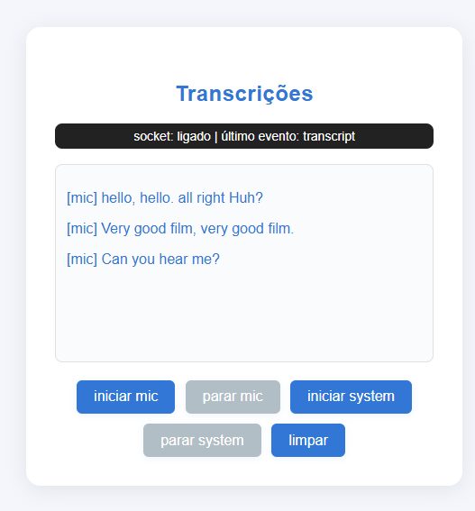

# interview transcriber 

## para que serve

transcreve em tempo real o que dizes ao microfone e/ou o que está a tocar no pc (tipo áudio de reunião, vídeo, etc). backend em flask + whisper, frontend em javascript puro. simples e direto.

---

## nota sobre deploy público

este projeto não tem demo online porque o whisper (modelo de transcrição) precisa de muita memória ram, e os planos gratuitos da cloud (tipo render, railway, heroku) não aguentam. para testar tudo, basta correr localmente no teu pc — está tudo explicado abaixo. se quiseres só ver como funciona, há imagens e podes pedir vídeo demo.

---

## estrutura do projeto

```
interview-transcriber/
  apps/
    backend/    # flask + socket.io (agora tudo modular)
      app.py                # arranca tudo, rotas e eventos
      audio_processing.py   # trata do áudio do mic
      system_audio_worker.py# trata do áudio do pc
      config.py             # configs fáceis de mudar
      requirements.txt
    frontend/   # javascript puro
  readme.md
```

---

## como rodar isto

```bash
git clone ...
cd interview-transcriber
python -m venv .venv && source .venv/bin/activate
pip install -r apps/backend/requirements.txt
cd apps/backend
python app.py  # backend
# abre http://localhost:5000 no browser para usar o frontend
```

---

## sobre áudio do sistema (windows, linux, macos)

### microfone
- funciona em qualquer sistema, sem stress.

### áudio do pc (o que ouves)
- windows:
  - o windows não deixa gravar o áudio do pc direto.
  - para isso, instala [vb-audio cable](https://vb-audio.com/cable/) ou [voicemeeter](https://vb-audio.com/voicemeeter/).
  - depois de instalar, mete o "cable input" como saída padrão do windows ou da app.
  - no backend, grava do "cable output".
  - para ouvires nos fones, ativa "escutar este dispositivo" nas propriedades do "cable output".

  #### passo a passo vb-audio cable (windows)
    - instala o vb-audio cable e reinicia o pc.
    - vai ao painel de controlo de som > separador "reprodução".
    - mete o **CABLE Input (VB-Audio Virtual Cable)** como dispositivo predefinido.
    - vai ao separador "gravação", seleciona **CABLE Output**, clica em propriedades.
    - no separador "escutar", ativa **escutar este dispositivo** e escolhe os teus fones/headset.
    - clica em ok. agora ouves tudo nos fones e podes gravar o áudio do pc escolhendo o "cable output" no programa.
    - o microfone continua a funcionar normalmente.


se não quiseres instalar nada, só funciona o microfone.

---

## dicas rápidas
- o backend agora está dividido por ficheiros, cada um faz uma coisa (olha os comentários nos .py)
- podes escolher o dispositivo por variável de ambiente ou no config.py.
- se quiseres mudar o modelo whisper, é só trocar no config.py (tiny, base, small, etc)

---

## problemas comuns
- system audio não aparece:
  - instala e configura o dispositivo virtual.
  - testa com `ffmpeg -list_devices true -f dshow -i dummy` (windows) para ver se aparece "cable output".
- só apanha o mic:
  - windows não deixa gravar o áudio do pc sem virtual cable.
- erro de permissão:
  - corre o terminal como admin.
- docker não apanha áudio:
  - corre local para testar áudio.

---



---

- licença mit

---

## bibliotecas principais usadas e para que servem

### backend (python)
- **flask-socketio** — comunicação em tempo real (websockets) entre frontend e backend
- **eventlet** — permite que o flask-socketio funcione bem com websockets
- **openai-whisper** — modelo de transcrição de áudio para texto (core do projeto)
- **sounddevice** — usado para interagir com dispositivos de áudio (pode ser útil para gravação local)
- **scipy** — manipulação de ficheiros de áudio (wav)
- **ffmpeg** (chamado via subprocess) — converte ficheiros de áudio para o formato certo
- **numpy** — manipulação de arrays de áudio

### frontend (javascript)
- **socket.io-client** — comunica com o backend em tempo real
- **mediarecorder api** (nativa do browser) — grava o áudio do microfone
- **javascript puro** — manipulação do DOM, UI, etc

---

## links úteis
- [whisper (openai)](https://github.com/openai/whisper)
- [vb-audio cable](https://vb-audio.com/cable/)
- [voicemeeter](https://vb-audio.com/voicemeeter/)
- [blackhole (macos)](https://existential.audio/blackhole/)

---

## nota

este projeto foi desenvolvido com apoio de ia (chatgpt/copilot) para acelerar e organizar o código.

